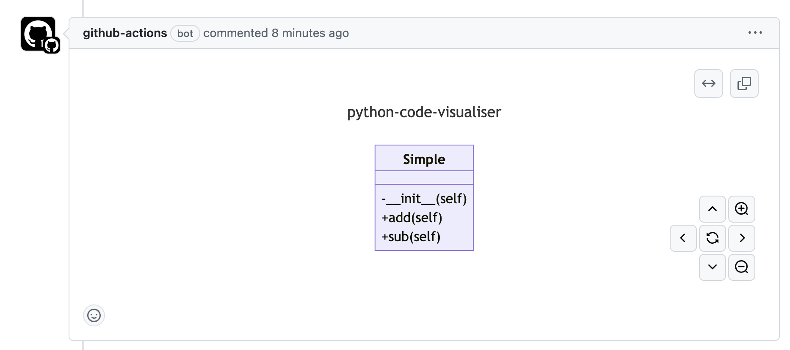

# python-code-visualiser
## Overview

Python Code Visualiser is a github action that will create mermaid class diagrams of pythong code from in the repo.  The diagram will be posted to a PR as a comment to assist with Code Review, and also saved as a build artifact.

The repo makes use of the fantastic [pymermaider](https://github.com/diceroll123/pymermaider) to create the diagrams.

## Usage
### Permission

The following workflow permissions are necessary:

```yml
permissions:
  contents: read
  pull-requests: write
```

### Inputs

`python-code-visualiser` uses the following inputs:

| Name       | Description                                                                                                                                                                                                              | Required | Default        |
| ---------- | ------------------------------------------------------------------------------------------------------------------------------------------------------------------------------------------------------------------------ | -------- | -------------- |
| `gh_token` | `GITHUB_TOKEN` (permissions `contents: read` and `pull-requests: write`) or a `repo` scoped [Personal Access Token (PAT)](https://docs.github.com/en/github/authenticating-to-github/creating-a-personal-access-token). | no       | `GITHUB_TOKEN` |

### Workflow

Add the following GitHub workflow to your repository.

```yaml
name: Insert Class Diagram
on:
  pull_request:
    branches:
        - main
  permissions:
    contents: read
    pull-requests: write
jobs:
  createClassDiagram:
    name: Create Diagram
    runs-on: ubuntu-latest
    steps:
    - uses: actions/checkout@v4
    - uses: miketrebilcock/python-code-visualiser@v1
      with:
        gh-token: ${{ secrets.gh_token }}
```

## Outputs
A comment will be added to a PR to display the class diagram using mermaid.


## Contributing

Contributions are more than welcome, just make a PR and we'll go from there!

## License

This project is licensed under the MIT license. Please see the
[LICENSE](LICENSE) file for more details.